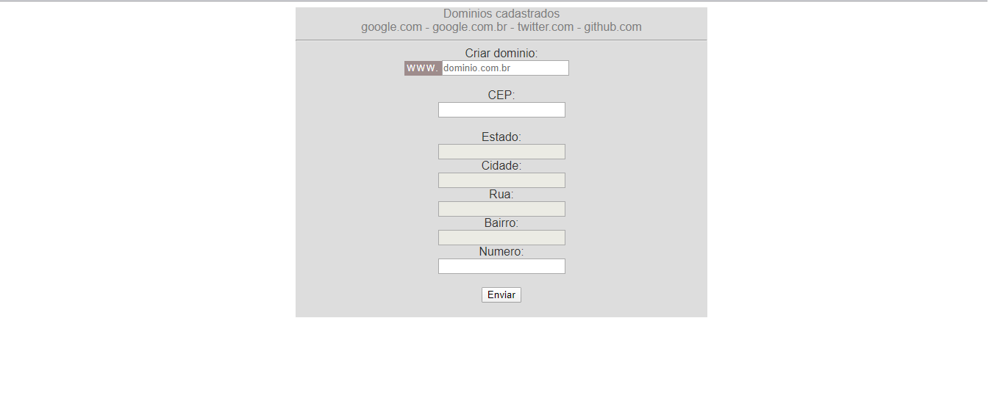

# CEP API

 

Um formulário que verifica com AJAX no banco se o nome do dominio já foi inserido. E atraves da API cep preenche os campos do endereço digitando apenas o CEP. 
Foi usado javascript com a biblioteca Jquey para fazer o uso de AJAX. Utilizado PHP e um pouco de SQL também.

# Instalação

<ul>
  <li>Execute em localhost com o xampp, wamp e outros.</li>
  <li>Para criar o banco de dados, tabelas e os dados.Copie e cole o código sql do arquivo: sql_dados.sql no heidiSQL ou PHPmyADMIN.</li>
</ul>
