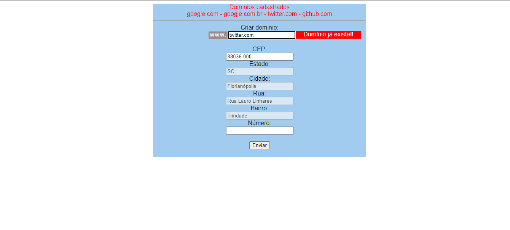

# CEP API

 

Verifica no banco de dados se o nome do domínio já foi cadastrado sem atualizar a página. Para isso utiliza o AJAX.

## API CEP

E através da API CEP preenche os campos do endereço digitando apenas o CEP.

## Teconologias

Foi utilizado Javascript com a biblioteca JQuery para fazer o uso de AJAX. Utilizei também PHP e um pouco de SQL também.

## Instalação

<ul>
  <li>Execute em localhost com o XAMPP, Wamp e outros.</li>
  <li>Para criar o banco de dados, tabelas e os dados.Copie e cole o código sql do arquivo: <i>sql_dados.sql</i> no heidiSQL ou PHPmyADMIN.</li>
</ul>
